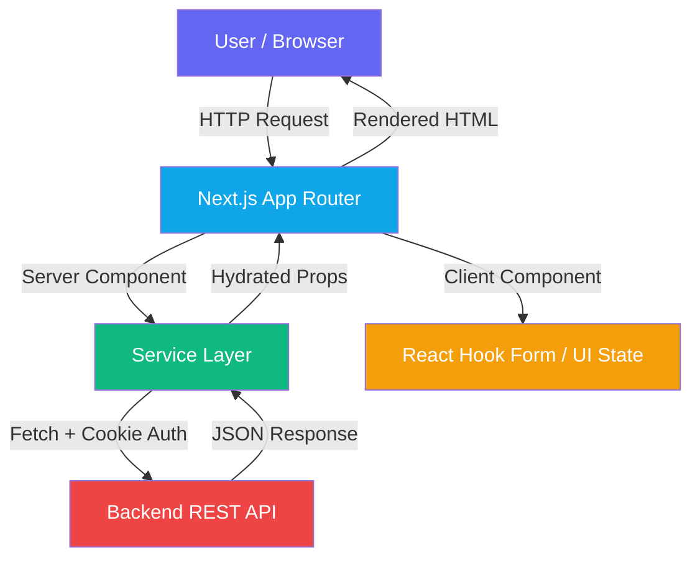
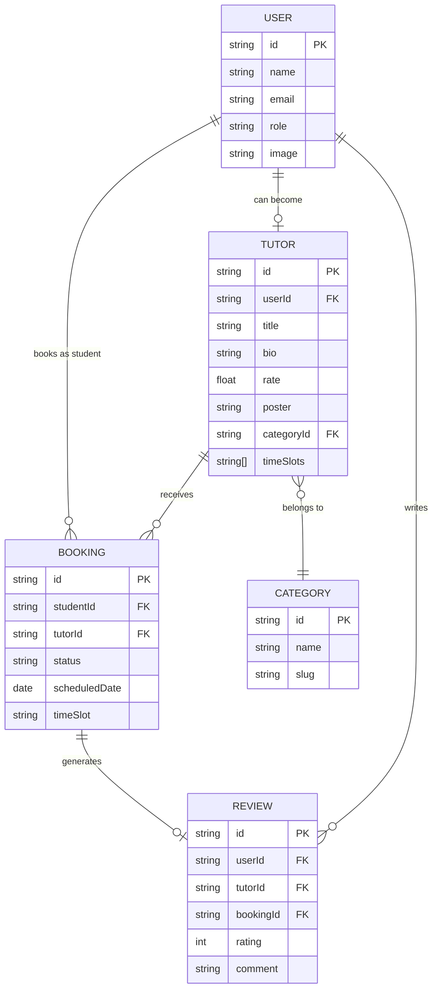

# 🧠 Brainy Client

[](https://nextjs.org/)
[](https://tailwindcss.com/)
[](https://www.typescriptlang.org/)
[](https://better-auth.com/)
[](https://www.framer.com/motion/)

Brainy is a modern, full-featured **online tutoring marketplace**. This repository contains the **Frontend Client**, built for visual excellence, snappy interactions, and strict role-based security across three distinct user tiers: Students, Tutors, and Administrators.

---

## 📖 Table of Contents

1. [Technical Architecture](#️-technical-architecture)
2. [Feature Ecosystem](#-feature-ecosystem)
3. [User Personas & Journeys](#-user-personas--journeys)
4. [Data Flow Diagram](#-data-flow-diagram)
5. [Core Development Principles](#️-core-development-principles)
6. [Folder Architecture](#-folder-architecture)
7. [Setup & Configuration](#-setup--configuration)
8. [Key API Integrations](#-key-api-integrations)

---

## 🏗️ Technical Architecture

The application is architected using a **Modular Component Design** approach, leveraging Next.js 16 App Router with Parallel Routes for role-based dashboard rendering — ensuring high maintainability and scalability.

### Core Stack

| Layer | Technology | Purpose |
|---|---|---|
| **Framework** | Next.js 16 (App Router) | SSR, SSG, Server Actions & Routing |
| **Styling** | Tailwind CSS 4 + Shadcn/UI | Premium design system with Radix primitives |
| **Language** | TypeScript 5 | End-to-end type safety |
| **Authentication** | Better Auth | Session-based auth with role extraction |
| **Animations** | Framer Motion + Lottie | Micro-interactions and hero animations |
| **Forms** | React Hook Form + Zod | Validated, schema-driven form handling |
| **Tables** | TanStack React Table | Sortable, filterable data tables |
| **Charts** | Recharts | Dashboard KPI visualizations |
| **UI Extras** | DnD Kit, Embla Carousel | Drag-and-drop sorting & image carousels |
| **Date Utils** | date-fns + Moment.js | Booking date handling and formatting |

---

## 🌟 Feature Ecosystem

### 🌐 Public Experience

- **Landing Page**: Animated hero with stats counter, featured tutors, and category showcase.
- **Tutor Marketplace**: Browse all verified tutors with subject category filters.
- **Tutor Detail Page**: Full profile with time slots, bio, session rate, and booking CTA.
- **Blog Section**: Platform-wide informational articles.
- **Contact Page**: Direct communication channel for inquiries.
- **SEO Optimized**: Dynamic metadata and semantic HTML for every page.

### 🎓 Student Suite

- **Tutor Discovery**: Browse and filter tutors by category and availability.
- **Session Booking**: Date- and time-slot-based booking with form validation.
- **Student Dashboard**: Upcoming and past session tracking with status visualization.
- **Booking Management**: Cancel pending bookings directly from the dashboard.
- **Verified Reviews**: Leave ratings and comments locked to confirmed bookings only.
- **Upgrade to Tutor**: Students can apply to become tutors from their profile dashboard.

### 🧑‍🏫 Tutor Workspace

- **Analytics Dashboard**: Revenue breakdown and session performance using Recharts.
- **Profile Management**: Update bio, hourly rate, availability slots, subject category, and poster image.
- **Booking Pipeline**: View all incoming bookings and update their status (confirm/reject).
- **Session Monitoring**: Track completed vs. pending sessions at a glance.

### 🛡️ Administrative Console

- **Platform Overview**: Real-time stats — total users, tutors, bookings, and revenue.
- **User Management**: View all registered users, update roles, and delete accounts.
- **Tutor Oversight**: Monitor all tutor profiles and manage platform listing integrity.
- **Booking Oversight**: Global view of all platform bookings and their statuses.
- **Category Manager**: Create, list, and delete subject categories used by tutors.

---

## 👥 User Personas & Journeys

### 1. The Student Flow

```
Discovery → Browse Tutors → View Profile → Book Session → Pay → Track → Review
```

- Uses the **Tutor Marketplace** to find subject-specific teachers.
- Uses **Time Slot selection** to pick a convenient booking window.
- Uses the **Student Dashboard** to monitor booking status in real time.
- Submits a **Review** after a session is confirmed complete.

### 2. The Tutor Flow (Pharmacist)

```
Register → Apply as Tutor → Setup Profile → Accept Bookings → Earn Revenue
```

- Uses **Profile Editor** to set rate, bio, availability, and category.
- Uses **Booking Pipeline** to confirm or reject student requests.
- Uses **Analytics Dashboard** to track earnings and session performance.

### 3. The Admin Flow

```
Login → Manage Users → Oversee Bookings → Curate Categories → Monitor Platform
```

- Uses **User Management** to control account roles and access.
- Uses **Category Manager** to maintain subject taxonomy.
- Uses **Booking Oversight** to audit and resolve platform disputes.

---

## 📊 Data Flow Diagram



### Entity Relationship Overview



---

## 🛠️ Core Development Principles

1. **Strict Typing**: Full TypeScript coverage across all service functions, API responses, and component props.
2. **Server-First Data Fetching**: Service functions run on the server, forwarding cookies directly to the backend — avoiding token exposure on the client.
3. **Visual Excellence**: Premium UI built with Shadcn/UI components, Framer Motion animations, Lottie illustrations, and custom Tailwind 4 design tokens.
4. **Performance First**:
   - Next.js Image optimization for all tutor posters.
   - `no-store` cache on all authenticated fetches to keep data fresh.
   - Carousel and DnD kit for smooth content reordering.
5. **Security**:
   - Session forwarding via `next/headers` cookies — no client-side token exposure.
   - Role-based route protection via Parallel Routes (`@admin`, `@tutor`, `@user`) and Middleware.
   - All mutations require valid session cookies propagated from the server.

---

## 📂 Folder Architecture

```text
src/
├── app/                         # Next.js App Router (Routes & Layouts)
│   ├── (CommonLayout)/          # Public-facing routes
│   │   ├── page.tsx             # Home / Landing Page
│   │   ├── tutors/              # Tutor listing & detail pages
│   │   ├── blog/                # Blog article pages
│   │   ├── contact/             # Contact form page
│   │   ├── login/               # Authentication - Sign In
│   │   └── register/            # Authentication - Sign Up
│   ├── (DashboardLayout)/       # Protected dashboard shell
│   │   ├── @admin/              # Admin-only parallel route slot
│   │   │   └── admin-dashboard/ # Admin views: users, bookings, categories
│   │   ├── @tutor/              # Tutor-only parallel route slot
│   │   │   └── tutor-dashboard/ # Tutor views: profile, bookings
│   │   └── @user/               # Student-only parallel route slot
│   │       └── dashboard/       # Student views: bookings, upgrade to tutor
│   └── routes/                  # App route definitions / constants
├── components/                  # Reusable UI Components
│   ├── ui/                      # Shadcn base components (Tailwind 4)
│   ├── shared/                  # App-specific shared logic
│   ├── layout/                  # Navbar, Footer, Sidebar
│   ├── modules/                 # Page-level feature modules
│   │   ├── home/                # Landing page sections
│   │   ├── tutor/               # Tutor card, profile, booking form
│   │   ├── auth/                # Login & register forms
│   │   ├── admin/               # Admin panel components
│   │   ├── user/                # Student dashboard components
│   │   ├── blog/                # Blog display components
│   │   └── contact/             # Contact page form
│   └── UserProfile/             # Shared user profile display
├── services/                    # Server-side API service layer
│   ├── booking.service.ts       # CRUD for session bookings
│   ├── tutor.service.ts         # Tutor listing, creation & updates
│   ├── user.service.ts          # User management, session retrieval
│   ├── review.service.ts        # Review creation and listing
│   ├── category.service.ts      # Subject category management
│   └── admin.service.ts         # Admin-specific platform operations
├── actions/                     # Next.js Server Actions
├── hooks/                       # Global utility hooks
├── lib/                         # Singleton utilities (auth client, helpers)
├── providers/                   # React context providers (Theme, etc.)
├── constants/                   # App-wide constant values
├── types/                       # Global TypeScript interface definitions
└── proxy.ts                     # API proxy utility for server-side fetches
```

---

## 🚀 Setup & Configuration

### Prerequisites

- **Node.js** v18+
- **npm** or **pnpm**
- A running instance of the [Brainy Backend API](https://github.com/sayed725/brainy_server)

### Installation

```bash
# Clone the project
git clone https://github.com/sayed725/brainy_client

# Enter the directory
cd brainy-client

# Install dependencies
npm install
# or
pnpm install
```

### Environment Variables

Create a `.env.local` file in the root directory:

```env
# Public API URL (used in server components for public data)
API_URL="http://localhost:5000"

# Backend URL (used for protected/authenticated mutations)
BACKEND_URL="http://localhost:5000"

# Frontend URL (used by Better Auth for CORS/redirects)
FRONTEND_URL="http://localhost:3000"

# Better Auth session endpoint
AUTH_URL="http://localhost:3000/api/auth"
```

> ⚠️ **Important**: `BACKEND_URL` and `AUTH_URL` must match the configuration on your backend server.

### Development Server

```bash
npm run dev
# or
pnpm dev
```

The app will be available at **`http://localhost:3000`**.

### Production Build

```bash
npm run build
npm run start
```

---

## 📄 Key API Integrations

All API calls are encapsulated in the **server-side service layer** located in `src/services/`. They use native `fetch` with cookie forwarding for secure session propagation.

| Service | File | Key Operations |
|---|---|---|
| **Tutor** | `tutor.service.ts` | `getAllTutors`, `getSingleTutor`, `createTutor`, `updateTutor`, `getTutorByUserId` |
| **Booking** | `booking.service.ts` | `createBooking`, `getAllBookings`, `getBookingsByUserId`, `getBookingsByTutorId`, `updateBookingStatus`, `deleteBooking` |
| **User** | `user.service.ts` | `getSession`, `getAllUser`, `updateUser`, `deleteUser` |
| **Review** | `review.service.ts` | `createReview`, `getAllReviews` |
| **Category** | `category.service.ts` | `getAllCategories`, `createCategory`, `deleteCategory` |
| **Admin** | `admin.service.ts` | Platform-level admin operations |

### Service Design Patterns

- **Cookie Forwarding**: All authenticated mutations use `next/headers` `cookies()` to securely forward session cookies to the backend — no client-side token exposure.
- **Structured Error Returns**: Every service method returns `{ data, error }` for predictable error handling without throwing unhandled exceptions.
- **No-Store Caching**: All authenticated and mutable endpoints use `cache: "no-store"` to guarantee fresh data on every render.
- **Schema Validation**: Outbound form data is validated with **Zod** schemas before submission via React Hook Form's `@hookform/resolvers`.

---

**Built with 💙 for modern, accessible, and intelligent education.**
